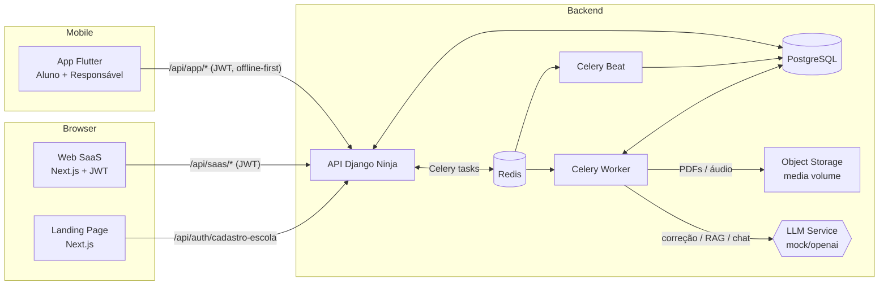

# SkillFlow

> Plataforma SaaS de educação com IA: Landing pública, Web SaaS para
> Professores e Coordenadores, App Flutter para Alunos e Responsáveis e API
> Django Ninja com correção assíncrona via Celery.



## Estrutura do monorepo

```
SkillFlow/
├── backend/   Django + Django Ninja + Celery
├── frontend/  Next.js (Landing pública + Web SaaS)
├── mobile/    Flutter (Aluno + Responsável)
└── docs/      Roteiros de demo, deploy Coolify, etc.
```

Documentos por subprojeto:

- [`backend/README.md`](backend/README.md)
- [`frontend/README.md`](frontend/README.md)
- [`mobile/README.md`](mobile/README.md)
- [`docs/coolify-deploy.md`](docs/coolify-deploy.md)
- [`PRD.md`](PRD.md), [`TechSpecs.md`](TechSpecs.md),
  [`DESIGN_GUIDELINES.md`](DESIGN_GUIDELINES.md)

## Stack

| Camada                       | Tecnologia                              |
|-----------------------------|-----------------------------------------|
| API                         | Django 5.1 + Django Ninja + JWT (`ninja-jwt`) |
| Banco                       | PostgreSQL 16 (SQLite em testes)        |
| Tarefas assíncronas         | Celery 5 + Redis 7 (Worker e Beat)      |
| Frontend Web (Landing+SaaS) | Next.js 14 App Router + Tailwind        |
| Mobile                      | Flutter (Aluno + Responsável, offline-first) |
| Infra local                 | Docker Compose                          |
| Deploy demo                 | Coolify (HTTPS para frontend e API)     |

## Como rodar tudo localmente

### Caminho rápido (one-shot Docker Compose)

```bash
cp .env.example .env                    # opcional, há defaults sensatos
cp backend/.env.example backend/.env    # opcional (env_file required:false)

docker compose up --build -d            # backend + db + redis + worker + beat + frontend
docker compose exec backend python manage.py seed_data --reset
```

Endereços expostos:

- **Frontend** → http://localhost:3000
- **API** → http://localhost:8000 (Swagger: `/api/docs`)
- **Healthcheck básico** → `GET /api/health/`
- **Healthcheck profundo (DB)** → `GET /api/health/?deep=1`

> O `entrypoint.sh` do backend espera o Postgres ficar disponível, roda
> `migrate` automaticamente e — se `SKILLFLOW_SEED=true` — também roda o seed.
> Worker e Beat sobem com `SKILLFLOW_RUN_MIGRATIONS=false` para não corrida com
> o backend.

Atalhos via `Makefile`:

```bash
make up              # docker compose up --build -d
make migrate         # python manage.py migrate
make seed            # seed_data --reset
make logs            # docker compose logs -f
make deep-health     # curl http://localhost:8000/api/health/?deep=1
make down            # docker compose down
```

### Backend isolado (sem Docker)

```bash
cd backend
python -m venv .venv && . .venv/Scripts/activate    # PowerShell: .venv\Scripts\Activate.ps1
pip install -r requirements.txt
cp .env.example .env
python manage.py migrate
python manage.py seed_data --reset
python manage.py runserver
```

### Frontend isolado (modo mocks ou conectado)

```bash
cd frontend
npm install
cp .env.local.example .env.local
# Default NEXT_PUBLIC_USE_MOCKS=true permite navegar sem API.
# Para conectar à API real:
#   NEXT_PUBLIC_API_URL=http://localhost:8000
#   NEXT_PUBLIC_USE_MOCKS=false
npm run dev
```

### App Mobile (Flutter)

```bash
cd mobile
flutter pub get
# Android emulador (10.0.2.2 é o host)
flutter run --dart-define=API_BASE_URL=http://10.0.2.2:8000 \
            --dart-define=USE_MOCKS=false
# iOS Simulator
flutter run --dart-define=API_BASE_URL=http://127.0.0.1:8000 \
            --dart-define=USE_MOCKS=false
# Dispositivo físico (mesma rede): substituir pelo IP local da máquina,
# ex.: 192.168.0.42:8000
```

Sem `--dart-define`, o app entra em modo mocks (boa para demonstração offline).

## Deploy em produção (Coolify)

A imagem do frontend é Docker multi-stage com `output: "standalone"` (apenas
`node server.js` em runtime, sem `node_modules` redundantes). A imagem do
backend tem entrypoint que aguarda Postgres, roda migrations e (opcionalmente)
seed antes de iniciar gunicorn.

Em produção, configurar três domínios HTTPS:

| Domínio                         | Serviço          |
|---------------------------------|------------------|
| `https://app.seu-dominio.com`   | Frontend Next.js |
| `https://api.seu-dominio.com`   | API Django Ninja |
| `(interno)`                     | Postgres, Redis, Celery worker, Celery Beat |

Detalhes passo a passo em [`docs/coolify-deploy.md`](docs/coolify-deploy.md).
Variáveis essenciais para o painel do Coolify:

```bash
# Backend (Coolify env)
DJANGO_DEBUG=false
DJANGO_SECRET_KEY=<gere-um-valor-forte>
DJANGO_ALLOWED_HOSTS=api.seu-dominio.com
CSRF_TRUSTED_ORIGINS=https://app.seu-dominio.com,https://api.seu-dominio.com
CORS_ALLOWED_ORIGINS=https://app.seu-dominio.com
CORS_ALLOW_ALL_ORIGINS=false
POSTGRES_HOST=db
REDIS_URL=redis://redis:6379/0
CELERY_BROKER_URL=redis://redis:6379/0
SECURE_SSL_REDIRECT=true
LLM_PROVIDER=mock          # ou 'openai' com LLM_API_KEY/LLM_MODEL setados

# Frontend (Coolify env, build-time)
NEXT_PUBLIC_API_URL=https://api.seu-dominio.com
NEXT_PUBLIC_USE_MOCKS=false
```

Healthchecks expostos:

- `https://api.seu-dominio.com/api/health/` (liveness)
- `https://api.seu-dominio.com/api/health/?deep=1` (com check de DB)

Build mobile release apontando para a API pública:

```bash
flutter build apk --release \
  --dart-define=API_BASE_URL=https://api.seu-dominio.com \
  --dart-define=USE_MOCKS=false
```

## Credenciais de demonstração

Após `python manage.py seed_data --reset`, você terá:

| Interface | E-mail                        | Papel        | Observação |
|-----------|-------------------------------|--------------|------------|
| Web       | `coordenador@skillflow.dev`   | Coordenador  | Vê toda a escola Horizonte |
| Web       | `professor@skillflow.dev`     | Professor    | Turmas 1A e 1B |
| Web       | `novato@skillflow.dev`        | Professor    | Senha provisória → cai em `/trocar-senha` |
| Web       | `coord2@skillflow.dev`        | Coordenador  | Escola Inovação (multi-tenant) |
| Mobile    | `aluno@skillflow.dev`         | Aluno        | Turma 1A |
| Mobile    | `pais@skillflow.dev`          | Responsável  | 2 filhos na turma 1A |

Senha em todos os usuários do seed: `skillflow123`.

Em modo de mocks (default em frontend e mobile) qualquer senha com 4+
caracteres autentica. Em modo real (`USE_MOCKS=false`), use a senha do seed.

## Roteiro de demonstração (≤ 10 min)

1. **Landing Page** (`http://localhost:3000`) — explicar valor, mostrar seções
   "Como funciona", "Funcionalidades" e CTA duplicado (topo + final).
2. **Cadastro de escola** (`/cadastro-escola`) — onboarding público, cria
   `Escola + Coordenador` em 1 transação e já joga no dashboard.
3. **Gestão SaaS** logada como Coordenador
   (`coordenador@skillflow.dev / skillflow123`):
   - listar turmas, abrir detalhe da turma → alunos, atividades, ranking;
   - cadastrar professor, vincular à turma;
   - cadastrar responsável e vincular ao aluno.
4. **Login Professor** (`professor@skillflow.dev`) → criar atividade EXERCICIO
   manual + criar atividade PROVA com peso → publicar.
5. **App Aluno** (`aluno@skillflow.dev`):
   - sincroniza atividades;
   - responde MC → correção instantânea;
   - envia PDF dissertativo → status "Em análise".
6. **Worker corrige a dissertativa** (no docker compose, `celery_worker`).
   Aluno vê resultado + feedback e abre **chat com o tutor IA** (3 perguntas
   máximo).
7. **Override de nota** pelo Professor (na Web). Aluno vê a nova nota final.
8. **Boletim do responsável** (`pais@skillflow.dev` no app mobile) → leitura
   das notas dos filhos.
9. **Analytics** (Web · Coordenador) — distribuição de erros, médias por
   disciplina, alunos em risco.
10. **Ranking** ativo/inativo por turma — ranking aparece/some no app.

## Como rodar os testes

```bash
# Backend (pytest, SQLite + Celery eager)
cd backend && pytest -ra

# Frontend (Jest + Testing Library + ESLint + build)
cd frontend && npm test && npm run lint && npm run build

# Mobile (flutter_test)
cd mobile && flutter test && flutter analyze
```

Resultado esperado: **90 testes** no backend, **16 testes** no frontend (10 suites),
e mais de uma dezena de testes em Flutter cobrindo offline-first, chat,
ranking e seletor de filhos.

## CI

`.github/workflows/ci.yml` roda em todo `push`/`pull_request` para `main`:

| Job       | O que faz                                              |
|-----------|--------------------------------------------------------|
| backend   | `pytest -ra` (SQLite + Celery eager)                   |
| frontend  | `npm ci`, `npm run lint`, `npm test`, `npm run build`  |
| mobile    | `flutter pub get`, `flutter analyze`, `flutter test`   |

Os três jobs rodam em paralelo, sem dependências entre si.

## Endpoints principais

| Método | Endpoint                                         | Quem |
|--------|--------------------------------------------------|------|
| `POST` | `/api/auth/cadastro-escola/`                     | público |
| `POST` | `/api/auth/login/`                               | público |
| `POST` | `/api/auth/refresh/` · `/logout/`                | autenticado |
| `POST` | `/api/auth/esqueci-senha/` · `/reset-senha/`     | público |
| `GET`  | `/api/saas/turmas/` · `/api/saas/turmas/{id}/`   | docente |
| `POST` | `/api/saas/turmas/{id}/alunos/cadastrar/`        | docente |
| `POST` | `/api/saas/turmas/{id}/alunos/cadastrar-massa/`  | docente (PDF) |
| `GET`  | `/api/saas/professores/`                         | coordenador |
| `POST` | `/api/saas/professores/{id}/vincular-turma/`     | coordenador |
| `POST` | `/api/saas/responsaveis/cadastrar/`              | coordenador |
| `POST` | `/api/saas/responsaveis/{id}/vincular-aluno/`    | coordenador |
| `POST` | `/api/saas/atividades/`                          | docente |
| `PUT`  | `/api/saas/atividades/{id}/aprovar-agendar/`     | docente |
| `PUT`  | `/api/saas/submissoes/{id}/override-nota/`       | docente |
| `GET`  | `/api/saas/turmas/{id}/analytics/`               | docente |
| `GET`  | `/api/app/painel/`                               | aluno |
| `GET`  | `/api/app/atividades/`                           | aluno |
| `POST` | `/api/app/submissoes/` (multipart)               | aluno |
| `GET`  | `/api/app/submissoes/{id}/resultado/`            | aluno |
| `POST` | `/api/app/submissoes/{id}/chat/`                 | aluno |
| `GET`  | `/api/app/turma/ranking/?tipo=pontuacao\|provas` | aluno |
| `GET`  | `/api/app/responsavel/filhos/`                   | responsável |
| `GET`  | `/api/app/responsavel/filhos/{id}/boletim/`      | responsável |
| `GET`  | `/api/health/`                                   | infra |

Documentação interativa Swagger/OpenAPI: `http://localhost:8000/api/docs`.

## Limitações conhecidas

- Provedor LLM real (OpenAI/Anthropic) está plugável via `services/llm_service.py`,
  mas o default é `MockLLMService` (resultado determinístico, sem custos).
- Notificações push usam um stub (`services/notification_service.py`); a
  integração FCM real fica como próximo passo, com o token já sendo coletado.
- Cadastro em massa por PDF usa um parser heurístico mock; trocar por LLM real
  é trivial via interface `LLMService.estruturar_alunos_pdf`.
- Ranking de pontuação faz somatório direto; para turmas grandes vale migrar
  para query agregada/cache.

## Decisões técnicas relevantes

- **Django Ninja** sobre DRF: type hints, OpenAPI automático e roteadores
  modulares por área (`auth`, `saas`, `app`).
- **JWT com blacklist** (`ninja-jwt`) para login único multi-cliente
  (Web + App Flutter) e logout que invalida o refresh.
- **Multi-tenant pelo escopo da Escola** com `escola_efetiva_id` derivado por
  papel — ALUNO via `turma.escola`, COORDENADOR/RESPONSAVEL via `escola_id`,
  PROFESSOR pelas vinculações em `ProfessorTurma`.
- **Offline-first** no app: SQLite local, fila persistente de submissões,
  carimbo `timestamp_local + client_server_offset_ms` validado no servidor
  com tolerância de 5 minutos. Conflitos viram `CONFLITO_SYNC` para resolução
  docente.
- **Celery Worker + Beat** dão correção dissertativa assíncrona, geração de
  exercícios via RAG e *drip content* (publicação automática de atividades
  agendadas a cada minuto).
- **Defesa contra prompt injection**: prompts do sistema explicitam que o
  conteúdo do PDF/aluno é não confiável e devem ser ignoradas instruções
  contidas neles.

## Documentos de referência

- [`PRD.md`](PRD.md) — regras de negócio e jornadas.
- [`TechSpecs.md`](TechSpecs.md) — modelagem, endpoints, fluxos síncronos/assíncronos.
- [`DESIGN_GUIDELINES.md`](DESIGN_GUIDELINES.md) — identidade visual e UX.
- [`PROMPT_*`](.) — prompts utilizados para implementar cada módulo.
# SkillFlow

