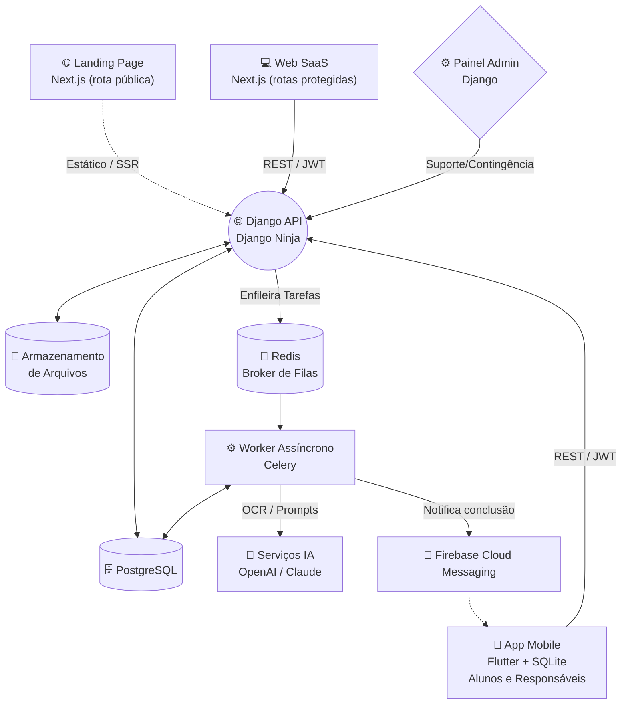
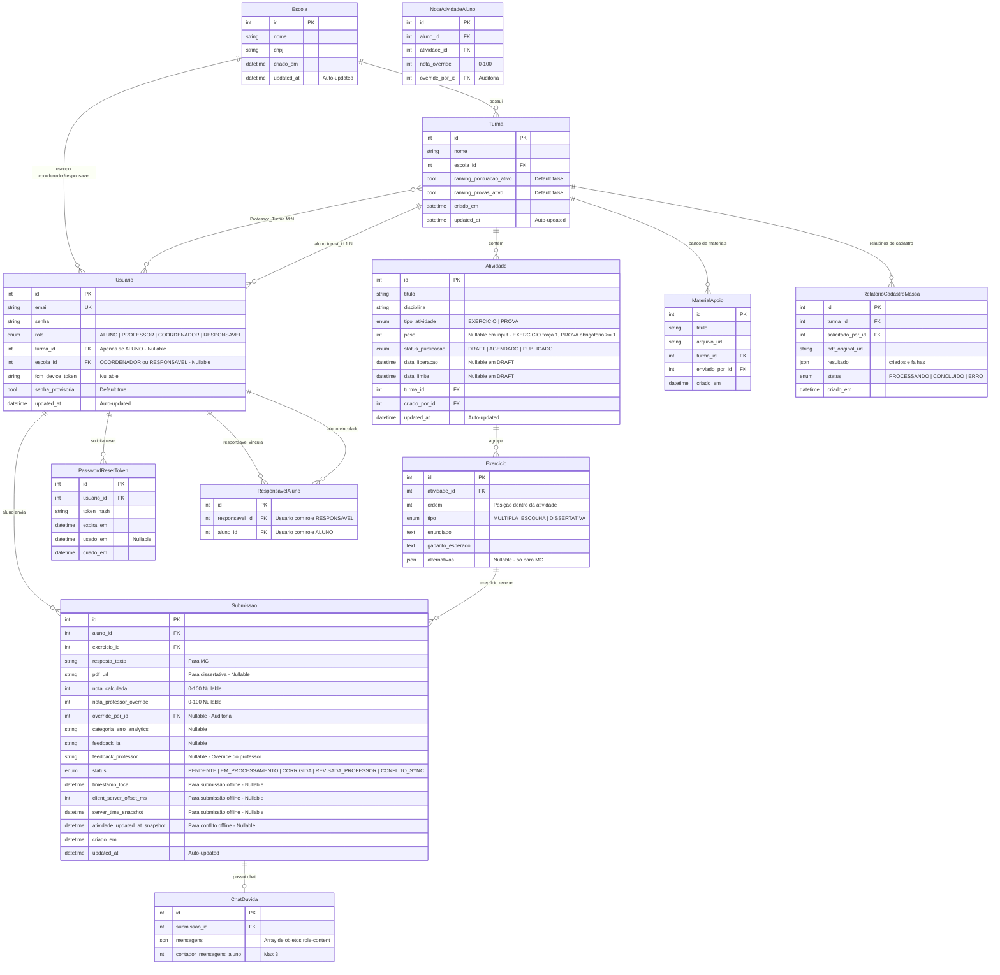
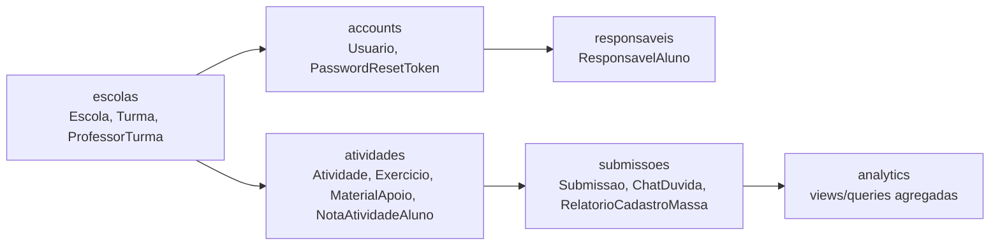

# Technical Specifications (Tech Specs)
## SkillFlow — Plataforma de Resolução de Exercícios com Correção Automática via IA

---

## 1. Arquitetura Geral do Sistema

A arquitetura do sistema adota um padrão de microsserviços lógicos, separando a responsabilidade de apresentação mobile, apresentação docente e lógica de negócios / IA.



- **Landing Page:** Rota pública do Next.js (`/`). Página estática/SSR apresentando o produto, com SEO e CTA.
- **Cliente Mobile (Alunos e Responsáveis):** **Flutter** para Android/iOS, com interface diferenciada por role. Alunos possuem suporte **offline-first** via SQLite local (cache de atividades + fila de submissões pendentes com timestamp local e offset do servidor), múltipla escolha (tap direto), captura por câmera com geração de PDF e seleção de PDF para dissertativas. Responsáveis acessam boletim somente leitura. **Push Notifications** via FCM são exclusivas para alunos.
- **Cliente Web SaaS (Professores e Coordenadores):** **React / Next.js** (rotas protegidas). Dashboard analítico (Analytics filtrado por disciplina), gestão de atividades (Draft, agendamento), onboarding de alunos/professores e override de correções.
- **Core API & Backoffice:** **Django + Django Ninja** (Python). Django Admin restrito a suporte operacional/contingência; o onboarding principal de novas escolas ocorre por auto-cadastro público.
- **Banco de Dados:** **PostgreSQL** para persistência relacional. Pontuações de `0 a 100`.
- **Armazenamento de Arquivos:** PDFs de submissões dos alunos e materiais de apoio dos professores armazenados via filesystem local (dev) ou serviço de storage em nuvem (produção, ex: S3).
- **Broker de Filas:** **Redis** como message broker para o motor assíncrono.

---

## 2. Fluxos Síncronos vs Assíncronos

### 2.1. Correção de Múltipla Escolha — SÍNCRONA
Questões de múltipla escolha possuem gabarito fechado (ex: alternativa "C"). A correção é uma **comparação direta** no backend (`resposta_aluno == gabarito`), sem envolver IA. Resultado: nota binária por questão (certo = 100, errado = 0). O aluno recebe o resultado instantaneamente na resposta da API.

### 2.2. Correção de Dissertativa — ASSÍNCRONA (Fila)
Questões dissertativas exigem leitura de PDF (OCR) e avaliação semântica via LLM. Pipeline:
1. App captura a resolução pela câmera e gera um PDF, ou permite selecionar um PDF existente. O arquivo final enviado ao backend é sempre PDF.
2. App envia o PDF com `timestamp_local`, `server_time_snapshot`, `client_server_offset_ms` e `atividade_updated_at_snapshot` → API valida prazo/metadados, grava a Submissão com `status = PENDENTE` e enfileira a tarefa.
3. Worker marca a Submissão como `EM_PROCESSAMENTO`, extrai texto do PDF (OCR) → monta prompt com gabarito + resposta → chama LLM.
4. LLM retorna JSON estruturado → Worker grava nota (0-100) e feedback → atualiza `status = CORRIGIDA`.
5. Se foi a última questão dissertativa pendente da atividade, Worker **recalcula a nota consolidada da atividade** e dispara **Push Notification** via FCM (apenas para alunos, não para responsáveis).

### 2.3. Cálculo Automático de Notas

**Nota da Atividade (média simples das questões):**
```
nota_atividade = soma_notas_exercicios / quantidade_exercicios
```
Onde:
- Exercício MC acertado = 100 | errado = 0
- Exercício Dissertativo = nota atribuída pela IA (0 a 100)
- Antes do vencimento, questões sem submissão/correção geram apenas nota parcial. Após `data_limite`, questões sem submissão válida contam como `0`, mantendo o divisor como `quantidade_exercicios`.

Se o professor fizer override em algum exercício individual (no nível da `Submissao`), o sistema recalcula a nota da atividade com o valor sobrescrito. Para override direto da nota consolidada da atividade por aluno, utiliza-se a tabela `NotaAtividadeAluno` — esse valor prevalece sobre o cálculo automático. Ao fazer override, o status da submissão transiciona para `REVISADA_PROFESSOR`.

**Média Geral do Aluno (ponderada por peso):**
```
media_geral = soma(nota_atividade * peso_atividade) / soma(peso_atividade)
```
Onde:
- Atividades do tipo `EXERCICIO` têm `peso = 1` (fixo)
- Atividades do tipo `PROVA` têm `peso` definido pelo professor (obrigatório ao criar)
- A média final é sempre de 0 a 100

**Rankings da Turma:**
- **Ranking de Pontuação:** `soma(nota_atividade)` de todas as atividades do aluno na turma. Ordenação descendente.
- **Ranking de Provas:** Média ponderada apenas de atividades do tipo `PROVA`: `soma(nota_prova * peso_prova) / soma(peso_prova)`. Ordenação descendente.

### 2.4. Geração RAG de Exercícios — ASSÍNCRONA
1. Professor anexa material de apoio (PDF de apostila, máx 50 MB) e solicita geração → API armazena o material e enfileira o job.
2. Worker extrai texto do material → monta prompt RAG → LLM gera questões.
3. Exercícios são criados dentro de uma Atividade com `status_publicacao = DRAFT`.
4. Professor revisa, edita e aprova no painel SaaS.
5. O material de apoio fica armazenado no banco de materiais da turma para ser reutilizado futuramente.

### 2.5. Cadastro em Massa de Alunos via PDF — ASSÍNCRONA
1. Professor/Coordenador seleciona a turma destino e faz upload de PDF (máx 10 MB) contendo lista de alunos (nome + email) → API armazena o PDF e enfileira o job.
2. Worker processa: se o PDF contém texto selecionável, extrai diretamente; se for escaneado, aplica OCR.
3. Worker envia o texto extraído ao LLM com prompt para estruturar em JSON: `[{"nome": "...", "email": "..."}, ...]`.
4. Para cada entrada válida, o sistema cria o usuário com `role = ALUNO`, `turma_id = turma_selecionada`, `senha_provisoria = True` e gera senha aleatória.
5. Entradas com email duplicado ou formato inválido são registradas como falhas.
6. Ao concluir, o sistema grava um relatório (JSON) com os resultados: criados com sucesso, falhas e motivos.

### 2.6. Drip Content — TASK PERIÓDICA (Celery Beat)
Uma task periódica roda a cada 1 minuto para transicionar atividades agendadas:
1. Busca atividades com `status_publicacao = AGENDADO` e `data_liberacao <= NOW`.
2. Atualiza `status_publicacao = PUBLICADO`.
3. O endpoint de listagem do aluno também filtra por `data_liberacao <= NOW`, garantindo dupla checagem.

### 2.7. Onboarding de Escola + Coordenador — SÍNCRONO (Público)
1. O visitante acessa o formulário público de cadastro e envia dados da escola + dados do Coordenador/Diretor.
2. A API valida unicidade de email e identificadores da escola (ex: CNPJ, quando informado).
3. Em transação única, cria `Escola` e o usuário `COORDENADOR` já vinculado por `escola_id`.
4. O login pode ser concluído no mesmo fluxo, retornando JWT inicial para acesso ao SaaS sem depender do Django Admin.

---

## 3. Integração com IA

- **Avaliação Rigorosa (Dissertativas):** A IA recebe Gabarito + Resposta transcrita do aluno. Formato de resposta forçado via prompt:
```json
{
  "nota_ia": 85,
  "feedback": "Você acertou a análise do contexto histórico, mas...",
  "classificacao_erro": "Interpretação de Texto"
}
```
- **Analytics (Curadoria de Erros):** A chave `classificacao_erro` alimenta queries agregadas (`GROUP BY classificacao_erro, disciplina`) para construir os gráficos do Dashboard Next.js.
- **Chat Tutor (MC e Dissertativa):** O aluno pode solicitar explicações sobre correções tanto de MC (ex: "Por que a alternativa B está errada?") quanto de questões dissertativas. Controlado por `contador_mensagens_aluno` no banco. Limite: 3 turnos por exercício. HTTP 403 ao exceder.
- **Proteção contra Prompt Injection:** Todo texto extraído de PDFs, materiais de apoio e respostas de alunos deve ser tratado como **conteúdo não confiável**. Os prompts do sistema devem instruir o modelo a ignorar comandos/instruções presentes nesses documentos e a usar o conteúdo apenas como dados de entrada. O backend deve validar e parsear JSON de saída com schema rígido antes de persistir resultados.

---

## 4. Regras de Validação e Segurança

### 4.1. Validação de Pertencimento (Professor ↔ Turma)
Ao criar atividades ou cadastrar alunos, a API **valida obrigatoriamente** que o Professor autenticado pertence à Turma alvo via consulta à tabela pivô `Professor_Turma`. Se não pertencer → HTTP 403. O Coordenador é isento dessa validação, mas está limitado à **sua escola** (via `escola_id` no perfil).

### 4.2. Validação de Prazo (data_limite)
- **Submissão online (sem `timestamp_local`):** A API verifica `NOW > data_limite` → rejeita com HTTP 400 ("Prazo expirado").
- **Submissão offline (com `timestamp_local`):** O App envia `timestamp_local` (ISO 8601), `server_time_snapshot`, `client_server_offset_ms` e `atividade_updated_at_snapshot`. A API calcula `timestamp_estimado_servidor = timestamp_local + client_server_offset_ms` e valida esse valor contra `data_limite`.
- **Mitigação contra manipulação de relógio:** A API aceita apenas uma tolerância pequena de clock drift (ex: 5 minutos). Se o offset estiver ausente, incoerente, muito antigo, ou se `atividade_updated_at_snapshot` divergir da atividade atual, a submissão recebe `status = CONFLITO_SYNC` e não é corrigida automaticamente.
- **Regra de decisão:** Se o body da submissão contém metadados offline completos e válidos, usa `timestamp_estimado_servidor`. Caso contrário, usa `NOW` do servidor ou marca conflito quando a submissão declarar origem offline sem metadados suficientes.

### 4.3. Validação de Role por Interface
- **Precedência:** rotas mais específicas devem ser avaliadas primeiro.
- Rotas públicas de autenticação (ex: `POST /api/auth/cadastro-escola/`, login e recuperação de senha) são isentas de JWT, com validação de payload e rate limit.
- Rota `/api/app/responsavel/*` → apenas `role = RESPONSAVEL`. Alunos/Docentes → HTTP 403.
- Demais rotas `/api/app/*` → apenas `role = ALUNO`. Responsáveis e Docentes → HTTP 403.
- Rota `/api/saas/*` → apenas `role = PROFESSOR | COORDENADOR`. Alunos/Responsáveis → HTTP 403.
- Rotas de Coordenador (ex: transferir turma, historico cross-turma, gestão de responsáveis) → apenas `role = COORDENADOR`. Professor → HTTP 403.

### 4.4. Override de Nota e Feedback — Hierarquia
O professor/coordenador pode fazer override **a qualquer momento** após a submissão (não há janela de tempo).

A nota final exibida ao aluno segue a regra de precedência:
```
nota_final = nota_professor_override ?? nota_calculada_sistema
feedback_final = feedback_professor ?? feedback_ia
```
- **Override individual:** Altera `nota_professor_override` e/ou `feedback_professor` na `Submissao`. Atualiza `status` para `REVISADA_PROFESSOR`.
- **Override consolidado (por aluno/atividade):** Utiliza a tabela `NotaAtividadeAluno` (aluno_id + atividade_id + nota_override + override_por_id).

Tanto o Professor (da turma) quanto o Coordenador podem executar o override. O último override prevalece. O campo `override_por_id` registra quem fez a alteração para auditoria.

### 4.5. Senha Provisória — Fluxo Forçado
O campo `senha_provisoria` (boolean, default `true`) é verificado no login. Se `true`, a API retorna no JWT um claim especial `must_change_password = true`. O App e a Web devem redirecionar imediatamente para a tela de troca de senha, bloqueando qualquer outra ação até que o endpoint `/api/auth/trocar-senha/` seja chamado.

### 4.5.1. Reset de Senha e Blacklist JWT
- **Reset de senha:** Implementar um model próprio `PasswordResetToken` com hash do token, usuário, expiração, data de uso e IP/user-agent opcionais. Tokens devem ser de uso único e expirar em prazo curto (ex: 30 minutos). Em dev, o token pode ser logado no console; em produção, deve ser enviado por email.
- **Refresh token blacklist:** Usar o mecanismo de blacklist do pacote JWT escolhido (`django-ninja-jwt`/SimpleJWT blacklist) ou tabela equivalente própria. O endpoint de logout deve invalidar o refresh token informado e impedir reutilização.

### 4.5.2. Limites e Segurança de Upload de Arquivo
- PDF de submissão (dissertativa): máximo **10 MB**
- Material de apoio (apostila): máximo **50 MB**
- PDF de cadastro em massa: máximo **10 MB**
- Validação de tipo: apenas arquivos `.pdf` são aceitos. Validar extensão, MIME real e assinatura/magic bytes do PDF. Outros formatos → HTTP 400.
- Segurança de processamento: limitar número de páginas, aplicar timeout de OCR/extração, tratar PDF malformado sem quebrar worker, registrar falhas e, em produção, usar antivírus/sandbox antes de processar arquivos enviados por usuários.

### 4.5.3. Auto-cadastro de Escola (Coordenador/Diretor)
- O endpoint público de cadastro cria **escola + coordenador** no mesmo fluxo, de forma transacional (sem criar somente metade dos dados).
- O usuário criado por auto-cadastro recebe `role = COORDENADOR`, `escola_id` preenchido e `senha_provisoria = False`.
- Email do coordenador e identificadores de escola devem ser validados contra duplicidade antes da criação.
- Em caso de conflito de unicidade, retornar erro de negócio (HTTP 409) com mensagem clara.

### 4.6. Validação de Vínculo Familiar (Responsável ↔ Aluno)
- Apenas `role = COORDENADOR` pode criar, editar ou remover vínculos `ResponsavelAluno`.
- O Responsável só pode visualizar dados de alunos aos quais está vinculado. Tentativa de acessar dados de aluno sem vínculo → HTTP 403.
- O vínculo é M:N (um responsável pode ter vários filhos, um aluno pode ter vários responsáveis).
- O Responsável possui `escola_id` no perfil. Coordenadores só podem cadastrar/listar responsáveis da sua própria escola e só podem vincular responsáveis a alunos da mesma escola.

### 4.7. Chat — Apenas Após Correção
O chat tutor só pode ser acessado quando a submissão está com status `CORRIGIDA` ou `REVISADA_PROFESSOR`. Se `PENDENTE` ou `EM_PROCESSAMENTO` → HTTP 400 ("Aguarde a correção para usar o chat").

### 4.8. Ranking — Visibilidade Controlada
O ranking só é retornado pela API se estiver ativo na turma (`ranking_pontuacao_ativo` ou `ranking_provas_ativo` na model `Turma`). Se desativado, a API retorna `{"ativo": false, "mensagem": "O ranking está desativado para esta turma"}`.

---

## 5. Modelagem de Dados (Entidades)



**Decisões-chave de modelagem:**
- A `Escola` do aluno é **inferida** pela sua turma (`aluno.turma.escola`). Não existe FK duplicada.
- `turma_id` no `Usuario` é preenchido apenas para role `ALUNO`. `escola_id` é preenchido para `COORDENADOR` e `RESPONSAVEL` (escopo de escola). Ambos nullable para as demais roles.
- `Professor_Turma` é tabela pivô M:N (professor leciona em várias turmas).
- **Entidade `Atividade`**: agrupa exercícios sob um título, disciplina e prazos comuns. Diferencia entre `EXERCICIO` (peso fixo 1) e `PROVA` (peso definido pelo professor). O campo `peso` pode chegar nulo no input para permitir validação explícita: `EXERCICIO` força `peso = 1`; `PROVA` exige `peso >= 1`. `data_liberacao` e `data_limite` são nullable em DRAFT, obrigatórios na publicação.
- **Entidade `NotaAtividadeAluno`**: tabela de override da nota consolidada por aluno/atividade. Substitui o antigo `nota_override` na Atividade (que era ambíguo para multi-aluno).
- **Entidade `MaterialApoio`**: armazena PDFs/apostilas enviados pelo professor para geração RAG. Reutilizáveis por turma.
- **Entidade `ResponsavelAluno`**: tabela pivô M:N entre responsáveis e alunos. Apenas o coordenador gerencia estes vínculos, sempre dentro da mesma escola do responsável e do aluno.
- **Entidade `RelatorioCadastroMassa`**: registra os resultados de cada operação de cadastro em massa via PDF.
- `Exercicio` não contém mais `disciplina`, `data_liberacao` nem `data_limite` — esses dados vivem na `Atividade` pai.
- `nota_calculada` na `Submissao` renomeado de `nota_ia` para refletir que também pode ser nota automática de MC (sem IA).
- Campos `ranking_pontuacao_ativo` e `ranking_provas_ativo` na `Turma` controlam a visibilidade de cada tipo de ranking.
- Campo `tipo_atividade` e `peso` na `Atividade` permitem diferenciar exercícios de provas e calcular média ponderada.
- Campo `override_por_id` em `Submissao` e `NotaAtividadeAluno` para auditoria de quem fez o override.
- `timestamp_local`, `client_server_offset_ms`, `server_time_snapshot` e `atividade_updated_at_snapshot` na `Submissao` são nullable (presentes apenas em submissões offline). Para online, usa-se `NOW` do servidor.
- Campos `updated_at` em entidades principais para auditoria e sincronização incremental do Flutter.
- Status `CORRIGIDA` (unificado — cobre tanto MC quanto dissertativa). Transiciona para `REVISADA_PROFESSOR` ao fazer override. Status `CONFLITO_SYNC` indica submissão offline não corrigida automaticamente por metadados incoerentes, atividade alterada/removida ou suspeita de manipulação de relógio.

### 5.1. Arquitetura PostgreSQL e Esquema Físico

O banco é relacional, multi-tenant por `Escola`, e usa o Django ORM como fonte final das migrations. O DDL abaixo é a referência conceitual para constraints, índices e relações que devem ser refletidos nas models/migrations.



**Enums PostgreSQL de referência:**
```sql
CREATE TYPE user_role AS ENUM ('ALUNO', 'PROFESSOR', 'COORDENADOR', 'RESPONSAVEL');
CREATE TYPE atividade_tipo AS ENUM ('EXERCICIO', 'PROVA');
CREATE TYPE atividade_status AS ENUM ('DRAFT', 'AGENDADO', 'PUBLICADO');
CREATE TYPE exercicio_tipo AS ENUM ('MULTIPLA_ESCOLHA', 'DISSERTATIVA');
CREATE TYPE submissao_status AS ENUM ('PENDENTE', 'EM_PROCESSAMENTO', 'CORRIGIDA', 'REVISADA_PROFESSOR', 'CONFLITO_SYNC');
CREATE TYPE relatorio_status AS ENUM ('PROCESSANDO', 'CONCLUIDO', 'ERRO');
```

**Tabelas principais:**
```sql
CREATE TABLE escolas (
    id BIGSERIAL PRIMARY KEY,
    nome VARCHAR(200) NOT NULL,
    cnpj VARCHAR(18) NOT NULL,
    criado_em TIMESTAMPTZ NOT NULL DEFAULT NOW(),
    updated_at TIMESTAMPTZ NOT NULL DEFAULT NOW(),
    UNIQUE (nome, cnpj)
);

CREATE TABLE turmas (
    id BIGSERIAL PRIMARY KEY,
    nome VARCHAR(100) NOT NULL,
    escola_id BIGINT NOT NULL REFERENCES escolas(id) ON DELETE CASCADE,
    ranking_pontuacao_ativo BOOLEAN NOT NULL DEFAULT FALSE,
    ranking_provas_ativo BOOLEAN NOT NULL DEFAULT FALSE,
    criado_em TIMESTAMPTZ NOT NULL DEFAULT NOW(),
    updated_at TIMESTAMPTZ NOT NULL DEFAULT NOW(),
    UNIQUE (escola_id, nome)
);

CREATE TABLE usuarios (
    id BIGSERIAL PRIMARY KEY,
    username VARCHAR(150) NOT NULL,
    email VARCHAR(254) NOT NULL UNIQUE,
    password VARCHAR(128) NOT NULL,
    role user_role NOT NULL,
    turma_id BIGINT NULL REFERENCES turmas(id) ON DELETE SET NULL,
    escola_id BIGINT NULL REFERENCES escolas(id) ON DELETE SET NULL,
    fcm_device_token VARCHAR(255) NULL,
    senha_provisoria BOOLEAN NOT NULL DEFAULT TRUE,
    is_active BOOLEAN NOT NULL DEFAULT TRUE,
    is_staff BOOLEAN NOT NULL DEFAULT FALSE,
    is_superuser BOOLEAN NOT NULL DEFAULT FALSE,
    date_joined TIMESTAMPTZ NOT NULL DEFAULT NOW(),
    updated_at TIMESTAMPTZ NOT NULL DEFAULT NOW(),
    CHECK (
        (role = 'ALUNO' AND turma_id IS NOT NULL AND escola_id IS NULL)
        OR (role IN ('COORDENADOR', 'RESPONSAVEL') AND escola_id IS NOT NULL AND turma_id IS NULL)
        OR (role = 'PROFESSOR' AND turma_id IS NULL AND escola_id IS NULL)
    )
);

CREATE TABLE password_reset_tokens (
    id BIGSERIAL PRIMARY KEY,
    usuario_id BIGINT NOT NULL REFERENCES usuarios(id) ON DELETE CASCADE,
    token_hash VARCHAR(128) NOT NULL UNIQUE,
    expira_em TIMESTAMPTZ NOT NULL,
    usado_em TIMESTAMPTZ NULL,
    criado_em TIMESTAMPTZ NOT NULL DEFAULT NOW()
);

CREATE TABLE professor_turmas (
    id BIGSERIAL PRIMARY KEY,
    professor_id BIGINT NOT NULL REFERENCES usuarios(id) ON DELETE CASCADE,
    turma_id BIGINT NOT NULL REFERENCES turmas(id) ON DELETE CASCADE,
    UNIQUE (professor_id, turma_id)
);

CREATE TABLE responsavel_alunos (
    id BIGSERIAL PRIMARY KEY,
    responsavel_id BIGINT NOT NULL REFERENCES usuarios(id) ON DELETE CASCADE,
    aluno_id BIGINT NOT NULL REFERENCES usuarios(id) ON DELETE CASCADE,
    UNIQUE (responsavel_id, aluno_id),
    CHECK (responsavel_id <> aluno_id)
);

CREATE TABLE materiais_apoio (
    id BIGSERIAL PRIMARY KEY,
    titulo VARCHAR(200) NOT NULL,
    arquivo_url TEXT NOT NULL,
    turma_id BIGINT NOT NULL REFERENCES turmas(id) ON DELETE CASCADE,
    enviado_por_id BIGINT NOT NULL REFERENCES usuarios(id) ON DELETE CASCADE,
    criado_em TIMESTAMPTZ NOT NULL DEFAULT NOW()
);

CREATE TABLE atividades (
    id BIGSERIAL PRIMARY KEY,
    titulo VARCHAR(200) NOT NULL,
    disciplina VARCHAR(100) NOT NULL,
    tipo_atividade atividade_tipo NOT NULL,
    peso INTEGER NULL,
    status_publicacao atividade_status NOT NULL DEFAULT 'DRAFT',
    data_liberacao TIMESTAMPTZ NULL,
    data_limite TIMESTAMPTZ NULL,
    turma_id BIGINT NOT NULL REFERENCES turmas(id) ON DELETE CASCADE,
    criado_por_id BIGINT NOT NULL REFERENCES usuarios(id) ON DELETE CASCADE,
    criado_em TIMESTAMPTZ NOT NULL DEFAULT NOW(),
    updated_at TIMESTAMPTZ NOT NULL DEFAULT NOW(),
    CHECK (
        (tipo_atividade = 'EXERCICIO' AND peso = 1)
        OR (tipo_atividade = 'PROVA' AND peso >= 1)
    ),
    CHECK (
        status_publicacao = 'DRAFT'
        OR (data_liberacao IS NOT NULL AND data_limite IS NOT NULL AND data_limite > data_liberacao)
    )
);

CREATE TABLE exercicios (
    id BIGSERIAL PRIMARY KEY,
    atividade_id BIGINT NOT NULL REFERENCES atividades(id) ON DELETE CASCADE,
    ordem INTEGER NOT NULL,
    tipo exercicio_tipo NOT NULL,
    enunciado TEXT NOT NULL,
    gabarito_esperado TEXT NOT NULL,
    alternativas JSONB NULL,
    UNIQUE (atividade_id, ordem),
    CHECK (
        (tipo = 'MULTIPLA_ESCOLHA' AND alternativas IS NOT NULL)
        OR (tipo = 'DISSERTATIVA' AND alternativas IS NULL)
    )
);

CREATE TABLE submissoes (
    id BIGSERIAL PRIMARY KEY,
    aluno_id BIGINT NOT NULL REFERENCES usuarios(id) ON DELETE CASCADE,
    exercicio_id BIGINT NOT NULL REFERENCES exercicios(id) ON DELETE CASCADE,
    resposta_texto TEXT NULL,
    pdf_url TEXT NULL,
    nota_calculada INTEGER NULL CHECK (nota_calculada BETWEEN 0 AND 100),
    nota_professor_override INTEGER NULL CHECK (nota_professor_override BETWEEN 0 AND 100),
    override_por_id BIGINT NULL REFERENCES usuarios(id) ON DELETE SET NULL,
    categoria_erro_analytics VARCHAR(200) NULL,
    feedback_ia TEXT NULL,
    feedback_professor TEXT NULL,
    status submissao_status NOT NULL DEFAULT 'PENDENTE',
    timestamp_local TIMESTAMPTZ NULL,
    server_time_snapshot TIMESTAMPTZ NULL,
    client_server_offset_ms INTEGER NULL,
    atividade_updated_at_snapshot TIMESTAMPTZ NULL,
    criado_em TIMESTAMPTZ NOT NULL DEFAULT NOW(),
    updated_at TIMESTAMPTZ NOT NULL DEFAULT NOW(),
    UNIQUE (aluno_id, exercicio_id)
);

CREATE TABLE nota_atividade_alunos (
    id BIGSERIAL PRIMARY KEY,
    aluno_id BIGINT NOT NULL REFERENCES usuarios(id) ON DELETE CASCADE,
    atividade_id BIGINT NOT NULL REFERENCES atividades(id) ON DELETE CASCADE,
    nota_override INTEGER NOT NULL CHECK (nota_override BETWEEN 0 AND 100),
    override_por_id BIGINT NULL REFERENCES usuarios(id) ON DELETE SET NULL,
    UNIQUE (aluno_id, atividade_id)
);

CREATE TABLE chat_duvidas (
    id BIGSERIAL PRIMARY KEY,
    submissao_id BIGINT NOT NULL UNIQUE REFERENCES submissoes(id) ON DELETE CASCADE,
    mensagens JSONB NOT NULL DEFAULT '[]'::jsonb,
    contador_mensagens_aluno INTEGER NOT NULL DEFAULT 0 CHECK (contador_mensagens_aluno BETWEEN 0 AND 3)
);

CREATE TABLE relatorios_cadastro_massa (
    id BIGSERIAL PRIMARY KEY,
    turma_id BIGINT NOT NULL REFERENCES turmas(id) ON DELETE CASCADE,
    solicitado_por_id BIGINT NOT NULL REFERENCES usuarios(id) ON DELETE CASCADE,
    pdf_original_url TEXT NOT NULL,
    resultado JSONB NULL,
    status relatorio_status NOT NULL DEFAULT 'PROCESSANDO',
    criado_em TIMESTAMPTZ NOT NULL DEFAULT NOW()
);
```

**Índices obrigatórios para performance e isolamento por escola:**
```sql
CREATE INDEX idx_usuarios_role ON usuarios(role);
CREATE INDEX idx_usuarios_turma ON usuarios(turma_id) WHERE turma_id IS NOT NULL;
CREATE INDEX idx_usuarios_escola ON usuarios(escola_id) WHERE escola_id IS NOT NULL;
CREATE INDEX idx_professor_turmas_turma ON professor_turmas(turma_id);
CREATE INDEX idx_responsavel_alunos_aluno ON responsavel_alunos(aluno_id);
CREATE INDEX idx_atividades_turma_status_liberacao ON atividades(turma_id, status_publicacao, data_liberacao);
CREATE INDEX idx_atividades_tipo ON atividades(tipo_atividade);
CREATE INDEX idx_exercicios_atividade ON exercicios(atividade_id);
CREATE INDEX idx_submissoes_aluno_status ON submissoes(aluno_id, status);
CREATE INDEX idx_submissoes_exercicio_status ON submissoes(exercicio_id, status);
CREATE INDEX idx_submissoes_categoria_erro ON submissoes(categoria_erro_analytics) WHERE categoria_erro_analytics IS NOT NULL;
CREATE INDEX idx_notas_atividade_aluno_atividade ON nota_atividade_alunos(atividade_id);
CREATE INDEX idx_relatorios_cadastro_status ON relatorios_cadastro_massa(status);
```

**Observações de implementação no Django:**
- Os nomes reais das tabelas podem seguir o padrão `app_model` do Django, mas as relações, constraints e índices acima devem ser preservados.
- As validações que dependem de role cruzada, como `ProfessorTurma.professor.role = PROFESSOR` e `ResponsavelAluno` dentro da mesma escola, devem ser reforçadas no `clean()`, nos serializers/schemas de entrada e nas permissões dos endpoints.
- O isolamento multi-tenant é aplicado em todas as queries por `turma.escola_id` ou `usuario.escola_id`, nunca apenas por filtros recebidos do cliente.
- Agregações de analytics devem ser queries/views derivadas de `submissoes`, `exercicios` e `atividades`, sem duplicar dados calculados em tabelas permanentes no MVP.

---

## 6. Endpoints (API Django Ninja — JWT)

### 6.1. Autenticação
- `POST /api/auth/cadastro-escola/` → Cadastro público de Coordenador/Diretor + Escola no mesmo fluxo (criação transacional)
- `POST /api/auth/login/` → Retorna access_token (com claim `must_change_password`), refresh_token e role
- `POST /api/auth/refresh/` → Renova access_token
- `POST /api/auth/trocar-senha/` → Troca senha provisória (obrigatório no 1º login)
- `POST /api/auth/esqueci-senha/` → Solicita reset (envia token por email; simulado via log em dev)
- `POST /api/auth/reset-senha/` → Body: `{token, nova_senha}`. Valida token e atualiza senha
- `POST /api/auth/logout/` → Invalida refresh token (blacklist)

### 6.2. SaaS Web (Professores / Coordenadores)

**Gestão de Turmas e Alunos:**
- `GET /api/saas/turmas/` → Lista turmas (Professor: só as dele | Coordenador: todas)
- `GET /api/saas/turmas/{id}/alunos/` → Lista alunos da turma
- `GET /api/saas/alunos/?q=busca` → Busca global de alunos na escola (apenas Coordenador)
- `POST /api/saas/turmas/{id}/alunos/cadastrar/` → Onboarding de aluno (**valida pertencimento do professor à turma**)
- `POST /api/saas/turmas/{id}/alunos/cadastrar-massa/` → Upload de PDF para cadastro em massa via IA (**valida pertencimento**). Retorna ID do relatório de processamento.
- `GET /api/saas/relatorios-cadastro/{id}/` → Consulta status/resultado do cadastro em massa (criados, falhas, motivos).
- `PUT /api/saas/alunos/{id}/transferir-turma/` → Muda turma (apenas Coordenador)
- `POST /api/saas/professores/cadastrar/` → Coordenador cadastra novo Professor
- `GET /api/saas/professores/{id}/turmas/` → Lista turmas vinculadas ao professor (apenas Coordenador da mesma escola)
- `POST /api/saas/professores/{id}/vincular-turma/` → Body: `{turma_id}`. Cria vínculo `ProfessorTurma` (apenas Coordenador da mesma escola)
- `DELETE /api/saas/professores/{id}/desvincular-turma/` → Body: `{turma_id}`. Remove vínculo `ProfessorTurma` (apenas Coordenador da mesma escola)
- `GET /api/saas/alunos/{id}/historico/` → Histórico completo cross-turma (apenas Coordenador)

**Gestão de Responsáveis (apenas Coordenador):**
- `POST /api/saas/responsaveis/cadastrar/` → Cadastra responsável com senha provisória. Body: `{nome, email}`.
- `GET /api/saas/responsaveis/` → Lista responsáveis cadastrados na escola do Coordenador.
- `POST /api/saas/responsaveis/{id}/vincular-aluno/` → Vincula responsável a um aluno. Body: `{aluno_id}`.
- `DELETE /api/saas/responsaveis/{id}/desvincular-aluno/` → Remove vínculo. Body: `{aluno_id}`.
- `GET /api/saas/responsaveis/{id}/alunos/` → Lista alunos vinculados ao responsável.

**Ranking:**
- `PUT /api/saas/turmas/{id}/ranking/` → Ativa/desativa ranking. Body: `{ranking_pontuacao_ativo: bool, ranking_provas_ativo: bool}`.
- `GET /api/saas/turmas/{id}/ranking/?tipo=pontuacao|provas` → Visualiza ranking da turma no painel SaaS.

**Atividades e Exercícios:**
- `POST /api/saas/atividades/` → Cria atividade com exercícios (**valida pertencimento**). Body inclui `tipo_atividade` (EXERCICIO/PROVA) e `peso` (obrigatório se PROVA).
- `PUT /api/saas/atividades/{id}/` → Edita atividade (apenas DRAFT: todos campos; PUBLICADO: apenas data_limite)
- `DELETE /api/saas/atividades/{id}/` → Exclui atividade DRAFT (em cascata). PUBLICADO com submissões → HTTP 409.
- `POST /api/saas/atividades/gerar-ia/` → Geração RAG assíncrona (salva como DRAFT)
- `PUT /api/saas/atividades/{id}/aprovar-agendar/` → Move DRAFT → AGENDADO/PUBLICADO (data_liberacao e data_limite obrigatórios)
- `GET /api/saas/atividades/?turma_id=X&tipo=EXERCICIO|PROVA` → Lista atividades por turma, filtrável por tipo

**Materiais de Apoio:**
- `POST /api/saas/turmas/{id}/materiais/` → Upload de apostila PDF
- `GET /api/saas/turmas/{id}/materiais/` → Lista materiais da turma (reutilizáveis para RAG)

**Correções e Override:**
- `GET /api/saas/submissoes/?turma_id=X` → Lista submissões (Professor: só turmas dele | Coordenador: todas)
- `GET /api/saas/submissoes/{id}/` → Detalhe com nota, feedback e PDF
- `PUT /api/saas/submissoes/{id}/override-nota/` → Override de nota e/ou feedback individual. Body: `{nota?, feedback?}`. Grava `override_por_id`. Atualiza status → `REVISADA_PROFESSOR`.
- `PUT /api/saas/atividades/{id}/override-nota-aluno/` → Override da nota consolidada por aluno. Body: `{aluno_id, nota}`. Usa tabela `NotaAtividadeAluno`.
- `PUT /api/saas/submissoes/{id}/resolver-conflito/` → Resolve submissão `CONFLITO_SYNC`. Body: `{acao: "aceitar"|"rejeitar"|"solicitar_reenvio", observacao?}`. Apenas Professor da turma ou Coordenador da escola.

**Analytics:**
- `GET /api/saas/turmas/{id}/analytics/` → Agregações por `classificacao_erro`, `disciplina` e `tipo_atividade`

### 6.3. Mobile App (Alunos)
- `GET /api/app/sync/server-time/` → Retorna horário atual do servidor para cálculo de `client_server_offset_ms`.
- `POST /api/app/device-token/` → Registra token FCM apenas para `role = ALUNO`. Responsáveis recebem HTTP 403.
- `GET /api/app/painel/` → Dashboard consolidado do aluno: média geral ponderada, progresso por disciplina, histórico de notas, resumo de atividades (pendentes/concluídas)
- `GET /api/app/atividades/` → Atividades PUBLICADAS da turma do aluno onde `data_liberacao <= NOW`. Filtrável por `?tipo=EXERCICIO|PROVA`
- `GET /api/app/atividades/{id}/exercicios/` → Lista exercícios de uma atividade
- `POST /api/app/submissoes/` → Envio de resposta. Body inclui `timestamp_local` e metadados offline quando aplicável. JSON para MC ou FormData+PDF para dissertativa. Valida `timestamp_estimado_servidor <= data_limite`; em caso de metadados incoerentes, cria `CONFLITO_SYNC`.
- `GET /api/app/submissoes/?atividade_id=X` → Status de cada submissão do aluno para uma atividade
- `GET /api/app/submissoes/{id}/resultado/` → Nota + feedback após Push Notification
- `POST /api/app/submissoes/{id}/chat/` → Chat com tutor IA. HTTP 400 se submissão não está corrigida. HTTP 403 se `contador >= 3`
- `GET /api/app/turma/ranking/?tipo=pontuacao|provas` → Ranking da turma do aluno. Retorna lista ordenada com posição, nome e pontuação de todos. Retorna `{ativo: false}` se desativado.

### 6.4. Mobile App (Responsáveis)
- `GET /api/app/responsavel/filhos/` → Lista alunos vinculados ao responsável logado (id, nome, turma, escola)
- `GET /api/app/responsavel/filhos/{aluno_id}/boletim/` → Boletim de atividades do filho: lista de atividades (separadas por EXERCICIO/PROVA) com nota, disciplina, data. Inclui média geral ponderada.
- `GET /api/app/responsavel/filhos/{aluno_id}/boletim/?disciplina=X` → Filtro por disciplina

---

## 7. Offline-First (Flutter)

**Tecnologia:** SQLite local via pacote `sqflite` ou `drift`.

- **Sincronização de Atividades:** Ao conectar, o App baixa atividades e exercícios disponíveis da turma do aluno e armazena no SQLite junto com `updated_at`, `server_time_snapshot` e `client_server_offset_ms`. Leitura funciona offline.
- **Fila Local de Submissões com Timestamp Protegido:** Respostas offline são salvas no SQLite com flag `sincronizado = false`, **`timestamp_local`** (DateTime do dispositivo no momento da resposta), `client_server_offset_ms`, `server_time_snapshot` e `atividade_updated_at_snapshot`. O serviço de background observa conectividade e envia automaticamente ao reconectar.
- **Indicadores Visuais:** Ícone de status offline na AppBar. Badge de "X respostas pendentes de envio".
- **Conflito de Dados:** Se uma atividade foi alterada/removida no servidor enquanto o aluno estava offline, ou se houver suspeita de manipulação de relógio, a sincronização cria submissão `CONFLITO_SYNC`. O app mostra "Envio em análise" e o painel SaaS permite que professor/coordenador aceite, rejeite ou solicite reenvio.

---

## 8. Estrutura de Repositório e Infraestrutura

**Estrutura de Monorepo:**
```
SkillFlow/
├── backend/          # Django + Ninja + Celery Workers
├── frontend/         # Next.js (Landing Page + SaaS)
├── mobile/           # Flutter (App para Alunos e Responsáveis)
├── docs/
│   ├── demo-roteiro.md
│   └── coolify-deploy.md
├── docker-compose.yml
├── .env.example
├── .dockerignore
├── PRD.md
├── TechSpecs.md
├── DESIGN_GUIDELINES.md
└── README.md
```

**Docker Compose para os Serviços (Infra):**
O `docker-compose.yml` orquestrará PostgreSQL, Redis (broker), backend Django, Celery Worker, Celery Beat e frontend Next.js.
Benefício: sobe toda a stack local com `docker compose up` e serve como base para deploy no Coolify.

**Deploy no Coolify:**
O deploy alvo será feito no Coolify usando aplicação Docker Compose conectada ao repositório. Apenas `frontend` e `backend` devem receber domínios públicos HTTPS. `db`, `redis`, `celery_worker` e `celery_beat` ficam internos.

Configuração esperada:
- Frontend público: `https://app.seu-dominio.com`
- API pública: `https://api.seu-dominio.com`
- `NEXT_PUBLIC_API_URL=https://api.seu-dominio.com`
- `ALLOWED_HOSTS` inclui o domínio da API.
- `CORS_ALLOWED_ORIGINS` e `CSRF_TRUSTED_ORIGINS` incluem o domínio do frontend.
- `DEBUG=False` e `SECRET_KEY` forte em produção.
- PostgreSQL e mídia usam volumes persistentes do Coolify.
- Migrations rodam como comando manual/one-off após o primeiro deploy.
- `seed_data` só deve rodar em ambiente de demonstração.
- `GET /api/health/` deve ser usado como healthcheck público da API.

**TailwindCSS + Shadcn/ui para o Painel Web (Next.js):**
Bibliotecas visuais para criar dashboards premium com velocidade e consistência estética.

**Paginação Padrão:**
Todos os endpoints GET que retornam listas usam paginação por página:
- Parâmetros: `?page=1&page_size=20` (default: page=1, page_size=20, máximo: 100)
- Resposta: `{count: N, next: url, previous: url, results: [...]}`

---

## 9. Resumo de Funcionalidades Chave

| Funcionalidade | Ator(es) | Interface | Impacto Arquitetural |
|---|---|---|---|
| Painel de Progresso do Aluno | Aluno | App Flutter | Novo endpoint `/api/app/painel/`, cálculo de média ponderada |
| Ranking Dual (Pontuação + Provas) | Aluno (visualiza), Professor/Coordenador (controla) | App + SaaS | Campos `ranking_*_ativo` na Turma, novo endpoint de ranking |
| Pais/Responsáveis | Responsável (App), Coordenador (SaaS) | App Flutter + SaaS | Nova role, model `ResponsavelAluno`, endpoints de boletim |
| Exercício vs Prova | Professor/Coordenador | SaaS | Campos `tipo_atividade` e `peso` na Atividade |
| Média Ponderada | Todos (afeta cálculos) | Backend | Fórmula de média ponderada por peso |
| Cadastro em Massa via PDF+IA | Professor/Coordenador | SaaS | Nova Celery task, model `RelatorioCadastroMassa`, OCR+LLM |
